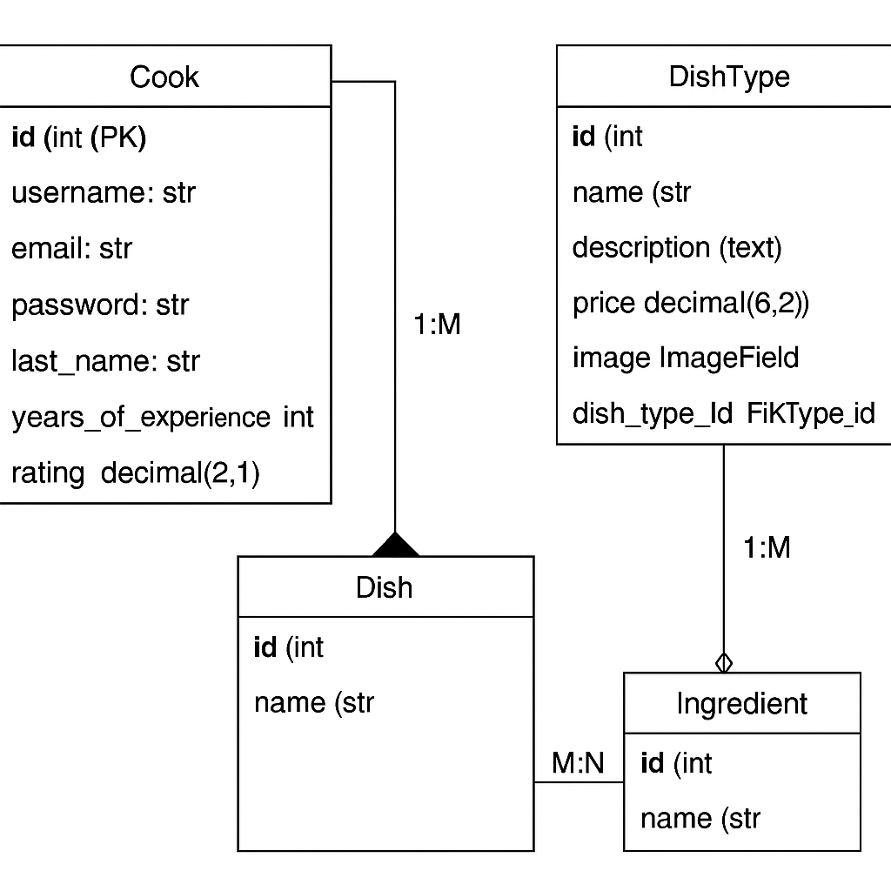
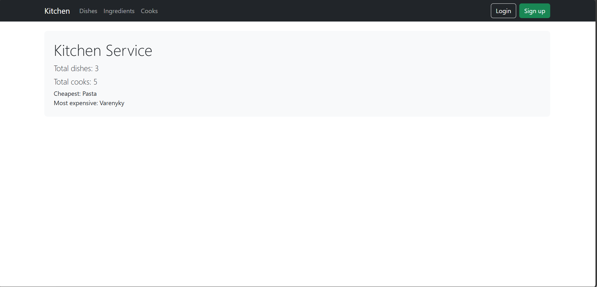
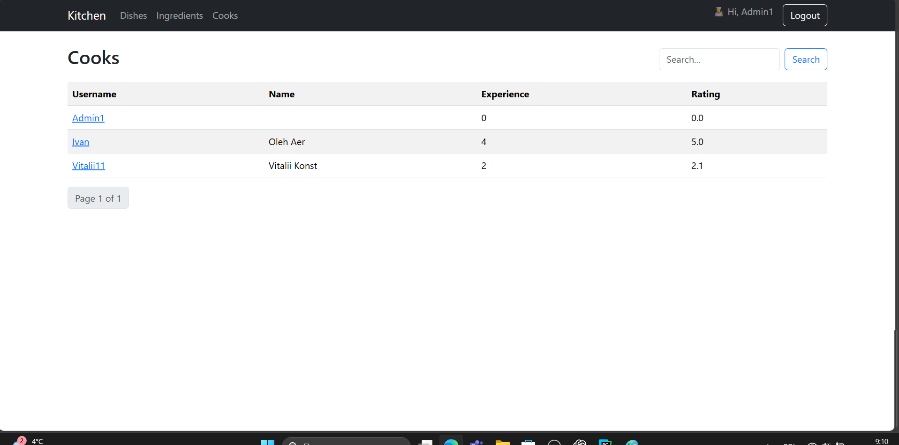
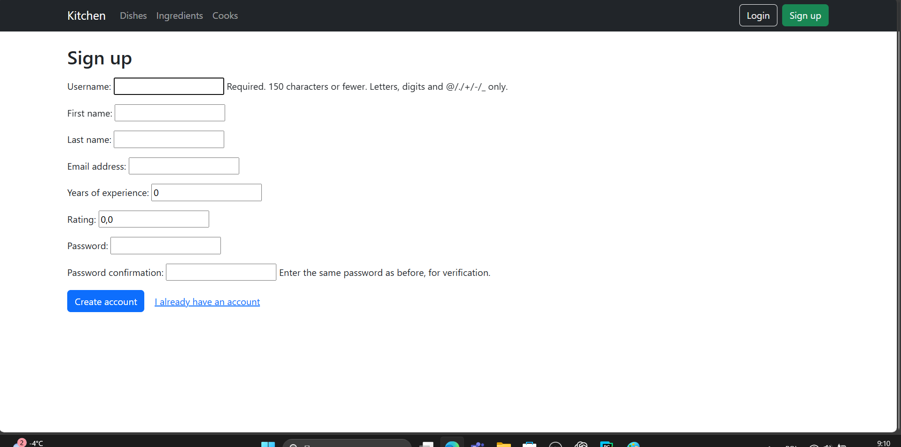
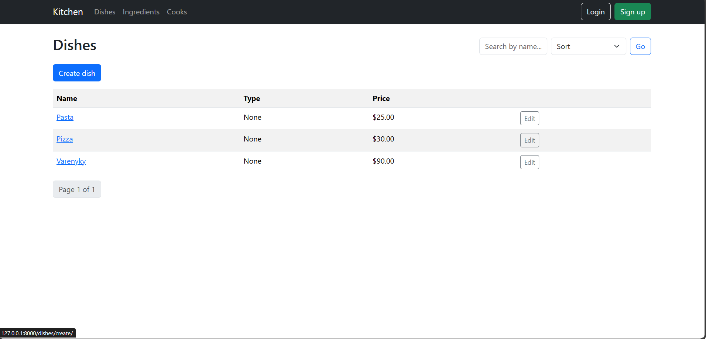
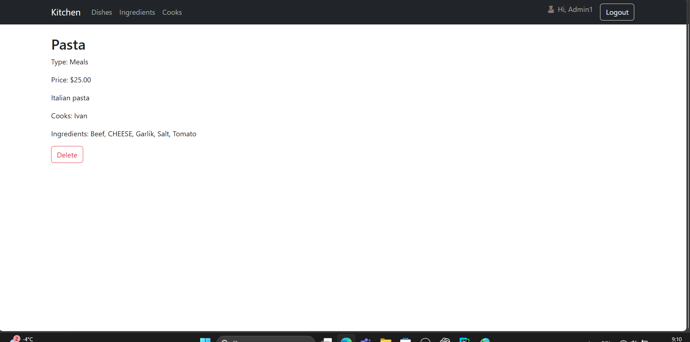
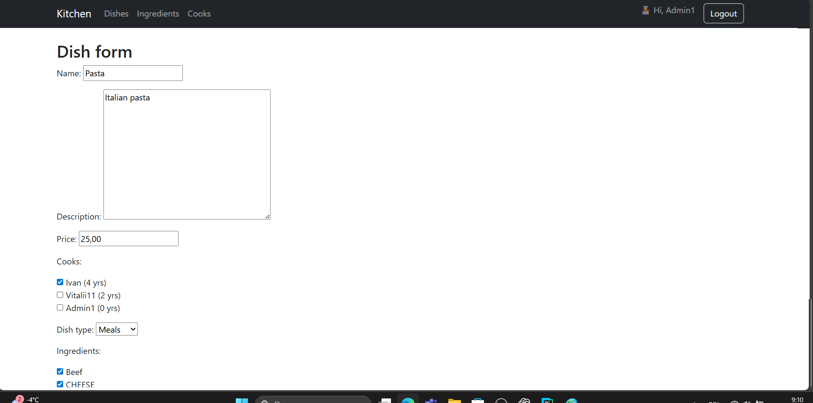
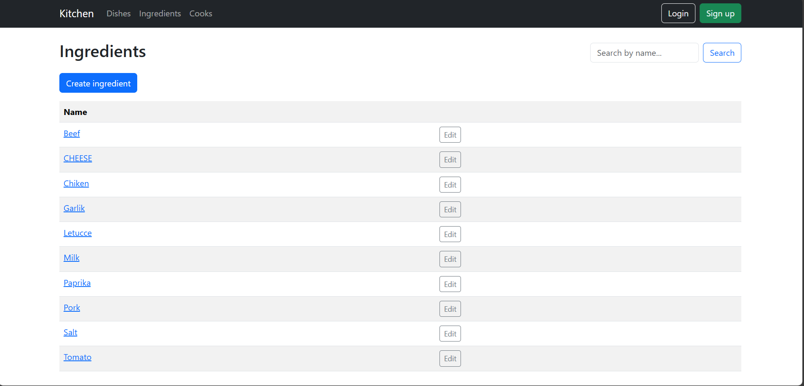

# 🍽️ Kitchen Service

A Django web application for managing restaurant kitchen operations.  
Cooks can add new dishes, assign themselves to dishes, and organize meals by type.

## 🚀 Deployed Project
You can view the live version here: [Kitchen Service on Render](https://kitchen-service-jk0h.onrender.com)

---

## 🧾 Description

**Kitchen Service** is a simple yet functional web platform that helps improve communication between restaurant cooks.  
It allows you to:
- Create and manage dish types (e.g., pasta, desserts, soups)
- Add dishes with prices and detailed descriptions
- Assign cooks responsible for each dish
- Search, sort, and paginate lists of dishes and cooks
- Manage ingredients and associate them with dishes
- Register, log in, and manage cook accounts

---

## 🧑‍💻 Technologies Used
- Python 3.12
- Django 5.x
- Bootstrap 5.3
- SQLite (default)
- Pillow (for image upload)
- Pytest (for tests)
- Django Extensions (for DB visualization)

---

## ✨ Features

- Custom user model `Cook` (`AbstractUser`)
- Fields: username, email, first_name, last_name, years_of_experience, rating
- CRUD for:
  - Cooks
  - Dishes
  - Dish Types
  - Ingredients
- Search and sorting (by name, price, username)
- Pagination (10 items per page)
- Login / Logout / Signup (auto login after registration)
- Bootstrap-based responsive UI
- Admin panel with filters and relations
- Field validations for experience and rating
- Unit tests (models and views)
- Database diagram and screenshots included

---

## 🧠 Database Diagram

Located in `docs/db-diagram.png`

---

## 🖼️ Screenshots

Located in `docs/`

| Page | Preview |
|------|----------|
| 🏠 **Home** |  |
| 🔐 **Login page** |  |
| 🧑‍🍳 **Cooks list** |  |
| ➕ **Create cook** |  |
| 🍝 **Dishes list** |  |
| 📄 **Dish detail** |  |
| 🧩 **Dish form (create/edit)** |  |
| 🧂 **Ingredients list** |  |

---
